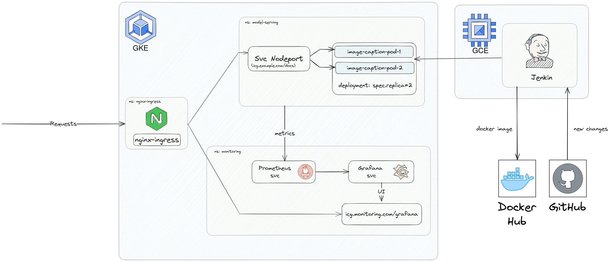

# Image Caption Generator

## System Architecture

* Image captioning generator using Hugging Face’s Vision Transformer ViT and Vision Encoder Decoder Models, integrating API endpoints via FastAPI, and containerized the applicaton using Docker.
* The Model is deployed on Google Kubernetes Engine (GKE), and monitored using Prometheus and Grafana.
* **CI/CD pipeline**: Jenkin is installed on GCE through Ansible to automate image pushes to Docker Hub and model deployment on GKE.
## Demo

### API
[Screencast from 2023-11-14 11:22:46 PM.webm](https://github.com/lapis2002/image-caption-generator/assets/47402970/342381fc-017c-4191-8b1b-0cce3993b792)

### Monitoring in Grafana
[Screencast from 2023-11-14 11:31:09 PM.webm](https://github.com/lapis2002/image-caption-generator/assets/47402970/3a607253-acec-450d-937c-18745d954732)

## Run Locally
### Install prerequisites
- python 3.10
```shell
pip install -r requirements.txt
```
### Connect
```
uvicorn main:app --host 0.0.0.0 --port 30000
```
Then, you can try the API at `localhost:30000/docs`.

## Deploy to GCP

### Install Gcloud Related Packages and Setup Project
* [**Install gcloud CLI**](https://cloud.google.com/sdk/docs/install#deb)
* **Install gke-gcloud-auth-plugin**
  ```
  sudo apt-get install google-cloud-cli-gke-gcloud-auth-plugin
  ```

* **Setup Gcloud Project**
  - Authorizes gcloud and other SDK tools to access Google Cloud and setup configuration
  ```
  gcloud init
  ```
  - Login to GCP
  ```
  gcloud auth application-default login
  ```
  
### Deploy Model to GKE
* **Create GKE Cluster with Terraform**
  ```
  cd terraform
  terraform apply
  ```
* **Connect to GKE Cluster**
  
  

* **Switch to GKE context**
  ```
  kubectx gke_mle-course-399400_us-east1_mle-course-399400-gke
  ```

* **Create namespaces**
  ```
  k create ns nginx-ingress
  k create ns model-serving
  k create ns monitoring
  ```
* **Deploy nginx ingress controller**
  ```
  helm upgrade --install nginx-ingress helm_charts/nginx-ingress -n nginx-ingress           
  ```
* **Deploy application to GKE cluster manually**
  ```
  helm upgrade --install image-caption-deployment helm_charts/model-deployment/image-caption -n model-serving
  ```
* **Update Domain Name to `/ect/hosts`**
  ```
  sudo vim /ect/hosts
  ```
  ```
  35.185.64.174 icg.example.com
  ```
* **Access FastAPI UI at icg.example.com/docs**
  
## Monitoring Systems

### Prometheus + Grafana

#### Install [kube-prometheus-stack](https://github.com/prometheus-community/helm-charts/tree/main/charts/kube-prometheus-stack)

* **Switch to `monitoring` namespace**
  ```
  kubens monitoring
  ```
  
- `kube-premetheus-stack` is downloaded from `prometheus-community` ([link](https://github.com/prometheus-community/helm-charts/tree/main/charts/kube-prometheus-stack)).

  * **Get Helm Repository Info (Optional)**
  ```sh
  helm repo add prometheus-community https://prometheus-community.github.io/helm-charts
  helm repo update
  ```
* **Exposing monitoring applications at web context**
  - To expose Prometheus, AlertManager, and Grafana at the same domain with different web contexts, we need to overwrite the default [`values.yaml`](https://github.com/prometheus-community/helm-charts/blob/main/charts/kube-prometheus-stack/values.yaml) with our custom file `kube-prometheus-stack.expanded.yaml` ([source](https://fabianlee.org/2022/07/02/prometheus-exposing-prometheus-grafana-as-ingress-for-kube-prometheus-stack/)).
  ```yaml
    grafana:
      env:
        GF_SERVER_ROOT_URL: http://icg.monitoring.com/grafana
        GF_SERVER_SERVE_FROM_SUB_PATH: 'true'
      # username is 'admin'
      adminPassword: prom-operator
      ingress:
        enabled: true
        annotations:
          kubernetes.io/ingress.class: nginx
          nginx.ingress.kubernetes.io/rewrite-target: /$2
        hosts: ['icg.monitoring.com']
        path: "/grafana"
    ``` 
* **Install Helm Chart**
  - Install `kube-prometheus-stack` and overwrite with our custom file:
    ```
    helm upgrade --install -f helm/k8s-monitoring/kube-prometheus-stack.expanded.yaml kube-prometheus-stack helm_charts/k8s-monitoring/kube-prometheus-stack -n monitoring
    ```
    - Or if we use helm charts from `prometheus-community`
    ```sh
    helm install -f helm/k8s-monitoring/kube-prometheus-stack.expanded.yaml kube-prometheus-stack prometheus-community/kube-prometheus-stack -n monitoring
    ```

* **Add Domain Name of the Cluster IP to `/etc/hosts`**
  - Add the Cluster IP to `/ect/hosts`
    ```
    sudo vim /ect/hosts
    ```
    ```
    35.185.64.174 icg.monitoring.com
    ```
  - Then Grafana can be accessed at `icg.monitoring.com/grafana`
  

## CI/CD with Jenkins in GCE

### Create Google Compute Engine

* **Create Service Account with Compute Admin Role**

  - Create a new service account with [Compute Admin](https://cloud.google.com/compute/docs/access/iam#compute.admin) role.
  - Create new key of the created service account and download it as json file.
  
  - Save it in `ansible/secrets`. Update the [service_account_file](https://github.com/lapis2002/image-caption-generator/blob/main/ansible/playbooks/create_compute_instance.yaml#L14) in `ansible/playbook/create_compute_instance.yaml` with the secret json file.

* **Create the Compute Engine**

  ```sh
  ansible-playbook ansible/playbooks/create_compute_instance.yaml
  ```

* **Update the ssh key**

  - Generate a new SSH key
    ```ssh-keygen```
  - Add the SSH key to Setting/Metadata/SSH KEYS
  
  - Update the [inventory file](https://github.com/lapis2002/image-caption-generator/blob/main/ansible/inventory) with the External IP address of the compute instance created in the previous step and the path to the ssh key file.
    

* **Install Jenkin on GCE**
  ```sh
  ansible-playbook -i ansible/inventory ansible/playbooks/deploy_jenkins.yaml
  ```
  

* **Connect to Jenkins UI**
  - Checking Jenkins installed successfully on GCE
    - Access the GCE instance
      ```
      ssh -i ~/.ssh/id_rsa YOUR_USERNAME@INSTANCE_EXTERNAL_IP
      ```
    - Verify if Jenkins is running in the Compute Engine instance
      ```
      sudo docker ps
      ```
  - Access Jenkins UI via `INSTANCE_EXTERNAL_IP:8081`.
  - Follow the instruction to log in into Jenkins.
  - The password can be retrieved by
    ```
    # inside GCE instance
    sudo docker exec -ti jenkins bash
    cat /var/jenkins_home/secrets/initialAdminPassword
    ```
* **Connect Jenkins to GitHub Repo**
  - Add Jenkins to Repo Webhook
    - Payload URL would `http://INSTANCE_EXTERNAL_IP:8081//github-webhook/`
    
    - Event Trigger can be set to: *Pushes* and *Pull Requests*
  - Add GitHub Repo to Jenkins
    - Create new Multibranch Item in Jenkins
    - Create a new Personal Access Token
    
    - Connect Repo to Jenkins
    
  

* **Add DockerHub Token to Jenkins Credential**
    - Create a new DockerHub Token
    - Add the token to Jenkins' Credentials
      - *Note*: ID must be `dockerhub` to match the `registryCredential` in [Jenkinsfile](https://github.com/lapis2002/image-caption-generator/blob/main/Jenkinsfile#L13).
    

* **Install the Kubernetes, Docker, Docker Pineline, GCloud SDK Plugins at `Manage Jenkins/Plugins`**
  - Install Plugins
  
  - Restart Jenkins in the Compute Engine instance after installing the plugins
  ```
  sudo docker restart jenkins
  ```
* **Setup Cloud Connection**
  
  - Create `clusterrolebinding`
  ```
    kubectl create clusterrolebinding cluster-admin-binding --clusterrole=cluster-admin --user=system:anonymous
    kubectl create clusterrolebinding cluster-admin-default-binding --clusterrole=cluster-admin --user=system:serviceaccount:model-serving:default
  ```
  - Configure clouds at `http://INSTANCE_EXTERNAL_IP:8081/manage/configureClouds/`
    - Get `Kubernetes URL` and `Kubernetes server certificate key`
      ```
      cat ~/.kube/config
      ``` 
      ```
      clusters:
        - cluster:
            certificate-authority-data: KUBERNETES_SERVER_CERTIFICATE_KEY
            server: KUBERNETES_URL
      ```
    

* **Build**
  - When there's new push/pull request, it will build and push the new version of image to DockerHub 
  - The deploy the application with the latest image from DockerHub to GKE cluster.
  

